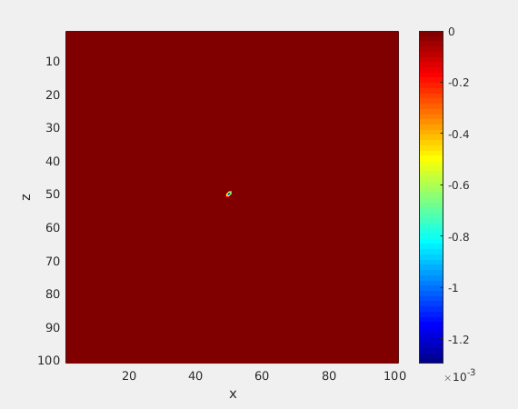

# SG-PML

交错网格（Staggered Grid）与完全匹配层（Perfectly Matched Layer）在波场模拟中的应用

## 开源协议

[MIT 协议](http://tchel.mit-license.org)

## 联系作者

Tche LIU, <seistche@gmail.com>, USTC

## 内容概述

[本文](./SG-PML.pdf)从完全匹配层的原理出发，基于空间上任意偶数阶差分近似，分别推导出了交错网格中声波方程和弹性波方程的离散形式。同时，在附录中给出了采用 Matlab 语言、Fortran 语言、C 语言以及 Cuda C 语言编写的波场模拟程序。

## 波场模拟效果

